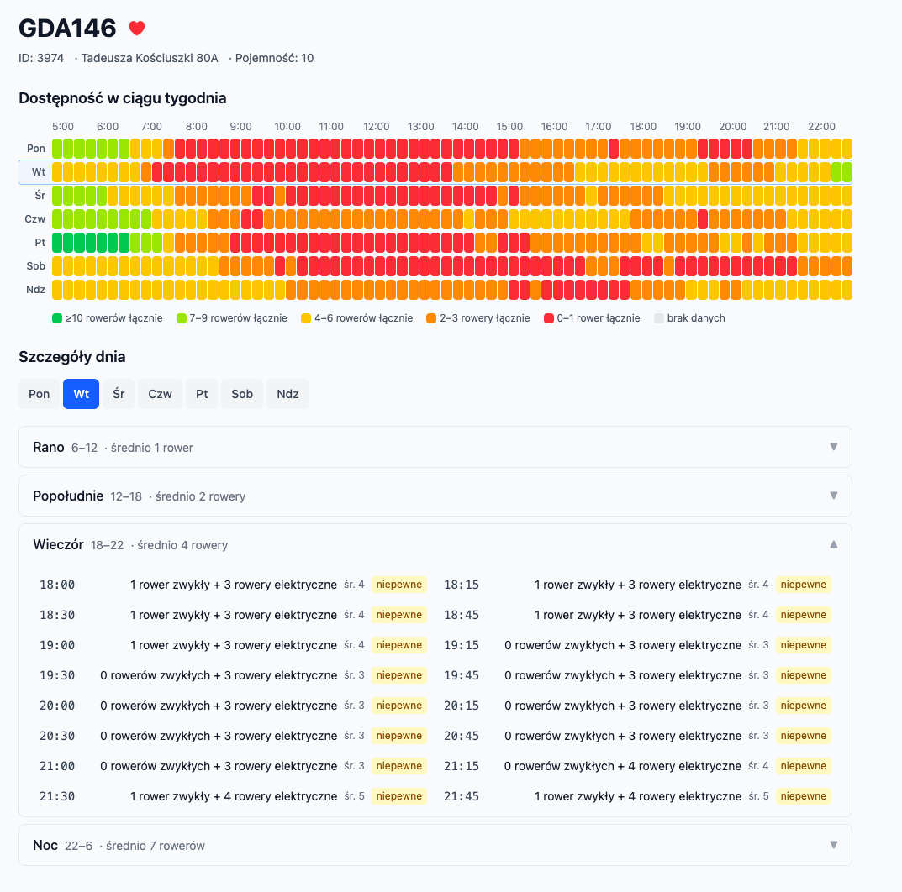

# MevoStats · [dailymevo.pl](https://dailymevo.pl)

It collects a snapshot of every Mevo bike-sharing station in Tricity (Gdańsk / Gdynia / Sopot) every 5 minutes and turns that stream into historical availability patterns — so you can plan your commute the night before.



## Features

- Station search across all Tricity Mevo locations
- Weekly availability heatmap per station — colour-coded by how many bikes are typically there
- Per-day breakdown into 15-minute slots, grouped by morning / afternoon / evening / night, with separate counts for regular and electric bikes
- Reliability label per slot (reliable / uncertain / typically empty) based on historical sample count
- Favourite stations for logged-in users, shown on the home page for quick access
- No account required to browse statistics

## Tech stack

| | |
|---|---|
| **Backend** | Python 3.12, FastAPI, asyncpg, APScheduler |
| **Frontend** | React 19, TypeScript, Vite, Tailwind CSS 4, TanStack Query |
| **Database** | PostgreSQL (Supabase), migrations via Alembic |
| **Auth** | fastapi-users, cookie-based JWT |
| **Tests** | pytest + pytest-asyncio (backend), Vitest + Testing Library (frontend), Playwright (E2E) |
| **Deployment** | Docker Compose on Mikr.us VPS, CI/CD via GitHub Actions |

## Running locally

```bash
# Backend
cp .env.example .env   # see .env.example for required variables
uv sync
uv run uvicorn app.main:app --reload
```

```bash
# Frontend
cd frontend && npm ci && npm run dev
```

```bash
# Tests
uv run pytest                      # backend
cd frontend && npm test            # frontend
npx playwright test                # E2E (needs both servers running)
```

See `context/RUNNING_TESTS.md` for full test setup including DB configuration.
